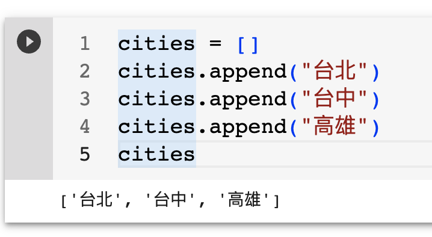
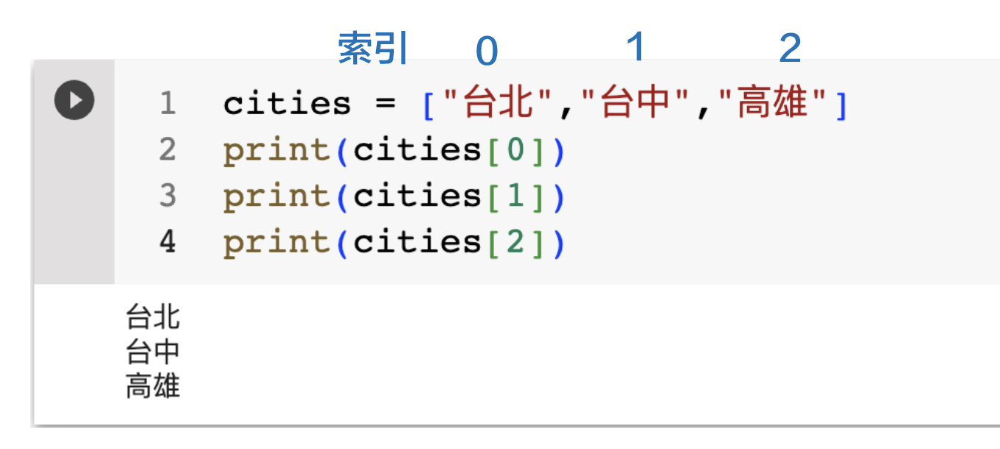
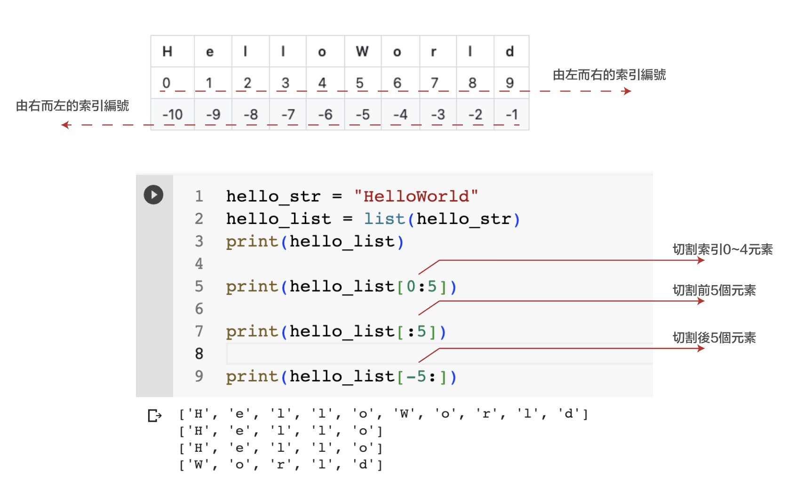

# python list操控
python的list, 就是一般常說的陣列,list操控是開發者最常使用的手法,靈活的操控list,也成為python必要的技能。

## list的主要功能

 - #### 儲存多組資料
 - #### 排序資料
 - #### 搜尋資料

## list常用的操控
 - #### 建立list
 - #### 新增元素
 - #### 選取元素
 - #### 讀取所有元素
 - #### 修改元素
 - #### 刪除元素
 - #### 切割元素

### 建立list
使用colab雲端編輯器,網址如下:

https://colab.research.google.com/?hl=zh-tw
#### 建立空list

```python
# 使用中括號 [] or list() 建立空的list

empty_list = [] #使用[]建立空的list
empty_list
```


#### 建立有內容的list

```python
weekdays = ['星期一', '星期二', '星期三', '星期四', '星期五', '星期六', '星期日'] 
weekdays
```


### 新增元素
- 使用append()
- 使用insert()

#### 使用append()新增元素
```python
cities = []
cities.append("台北")
cities.append("台中")
cities.append("高雄")
cities
```


#### 使用insert()新增元素

```python
cities = ["台北","台中","高雄"]
cities.insert(0,"基隆")
cities
```


### 選取元素
- 取存list元素,所依靠的是索引編號

```python
cities = ["台北","台中","高雄"]
print(cities[0])
print(cities[1])
print(cities[2])
```



### 讀取所有元素
- 利用for_in迴圈讀取所有內容

```python
weekdays = ['星期一', '星期二', '星期三', '星期四', '星期五', '星期六', '星期日'] 
for elem in weekdays:
  print(elem)
```


### 修改元素

```python
weekdays = ['星期一', '星期二', '星期三', '星期四', '星期五', '星期六', '星期日'] 

weekdays[6] = 'sunday'

Weekdays
```


### 刪除元素

- pop()->移除最後元素
- remove()->依元素值移除,沒有此元素,則出錯

#### remove()移除

```python
cities = ["台北","桃園","台中","台南","高雄"]

if "桃園" in cities:
  cities.remove("桃園")

cities
```


#### pop()移除最後一個元素

```
cities = ["台北","桃園","台中","台南","高雄"]

cities.pop()

cities

```


### 切割元素

```
hello_str = "HelloWorld"
hello_list = list(hello_str)
print(hello_list)

print(hello_list[0:5])

print(hello_list[:5])

print(hello_list[-5:])
```



### 實際操作(中文姓名產生器)
#### 結果如下:


#### 第1部份下載200組姓名文字

```
import requests

url = 'https://raw.githubusercontent.com/roberthsu2003/learningPythonFromZero/master/13python_list%E7%9A%84%E6%93%8D%E6%8E%A7/names.txt'
response = requests.get(url)
names_str = ""
if response.status_code == 200:
  names_str = response.text
names_str
```


- 第1行 載入下載工具requests
- 第3行 姓名文字的網址
- 第4行 執行下載動作
- 第6行 檢查下載是否成功
- 第7行 取出文字內容,儲存至變數names_str

#### 第2部份下載姓名文字轉成list

```python
names = names_str.split()
names
```


- 第1行 使用字串功能的split(),將字串轉換為list,儲存於names

### 第3部份建立操作界面

```python
import random
print("中文姓名產生器:\n")

first_name = input("請輸入您的姓(first_name):")
num = int(input("請輸入要產生的組數(不可超過20組):"))
choise_names = random.choices(names,k=num)
print(f"\n產生以下{num}組中文姓名:")
for name in choise_names:
  last_name = name[-2:]
  random_name = first_name + last_name
  print(random_name)
```


- 第1行 下載內建的random工具箱
- 第2行 使用random工具箱內的choices(),取出亂數選取的名字,參數k=num,代表要產生的list元素數量。
- 第8行 使用for...in將list變數choise_names，一個一個取出裏面的名字
- 第9行 取出name字串後的2個文字
- 第10行 組合使用者輸入的姓,加上取出的最後2個文字(名)

### 完整程式碼:

```python
import requests
import random

url = 'https://raw.githubusercontent.com/roberthsu2003/learningPythonFromZero/master/13python_list%E7%9A%84%E6%93%8D%E6%8E%A7/names.txt'
response = requests.get(url)
names_str = ""
if response.status_code == 200:
  names_str = response.text
names = names_str.split()
print("中文姓名產生器:\n")

first_name = input("請輸入您的姓(first_name):")
num = int(input("請輸入要產生的組數(不可超過20組):"))
choise_names = random.choices(names,k=num)
print(f"\n產生以下{num}組中文姓名:")
for name in choise_names:
  last_name = name[-2:]
  random_name = first_name + last_name
  print(random_name)
```


