# 輕鬆安裝python
要學習python程式語言前,必需要有一套編輯器,才有辦法學習python,小編將教各位3種簡單的方式，如下: 

1. 使用google Colab雲端編輯器,只要有瀏覽器(建議使用chrome),就可以開始編寫python,是最無痛最簡單的方式。 
	 
2. 使用官方Python,需要在自已的電腦上安裝python直譯器

3. 使用免費的VS Code,一套不錯使用的編輯軟體,要使用VS Code前,也必需先在自已的電腦上案裝python直譯器

### 1.使用雲端編輯器Colab
	1.1 打開chrome,並搜尋google Colab,或直接點進官網https://colab.research.google.com
	1.2 按右上角的「登入按鈕」,並使用自已的google帳號登入
	1.3 點選「google雲端硬碟」,並按下「新增筆記本」按鈕。如下圖1-1: 

	
	1.4 更改左上角檔案名稱「xxx.ipynb」,檔案將儲存在google drive雲端硬碟內.如下圖1-2
	
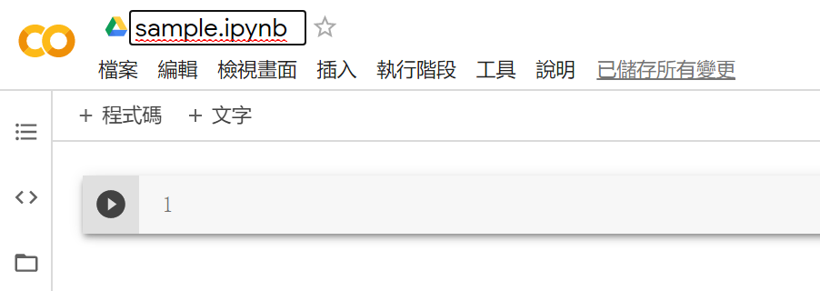

	1.5 在儲存格內輸入,並按下「shift + enter」
	>>> print('Hello! python.')
	Hello! python.
	代表一切都完成了，可以放心學習python語言。如下圖1-3
	
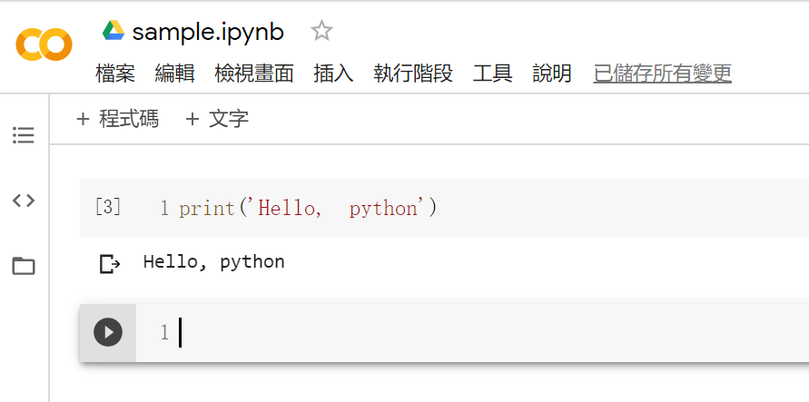

### 2使用本地電腦端python 
	2.1 至python官網(https://www.python.org)下載最新版本python3.x安裝檔(3.5版以上不可以使用window xp以下的版本)。如圖2-1:
	
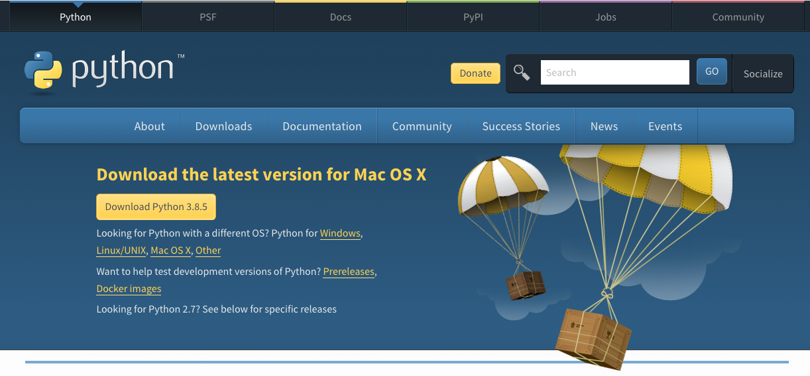

	2.2 下載安裝時,將是一個重要的階段,中間安裝錯誤,將會使python部份功能無法正常執行。將選取python-3.x.x執行檔並按下右鍵以系統管理員身份執行.如圖2-2
	
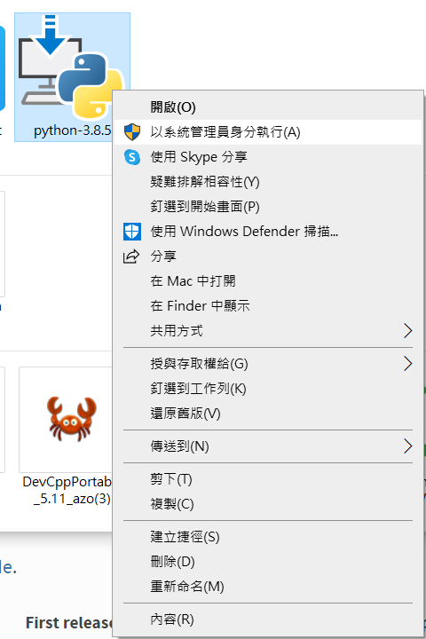
	
	2.3 「Add Python 3.8 to PATH」請打勾，並且選擇自訂安裝。如圖2-3

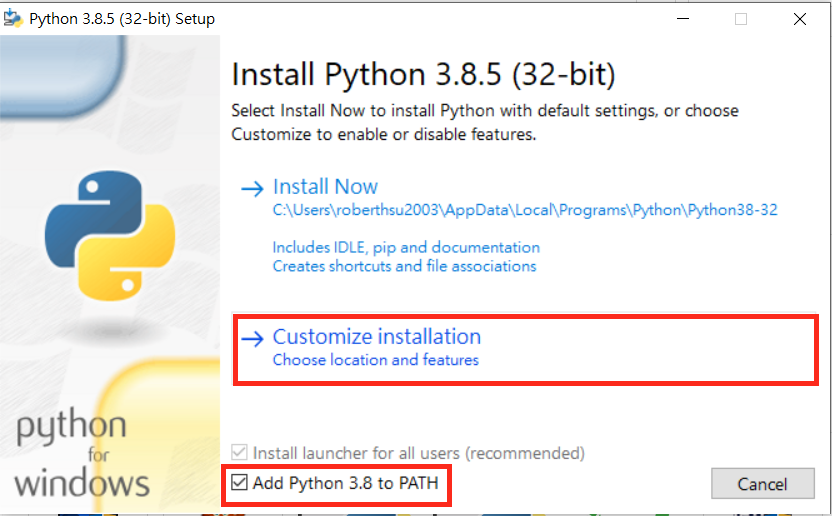 

	2.4 選擇功能頁面全部打勾。如圖2-4
	
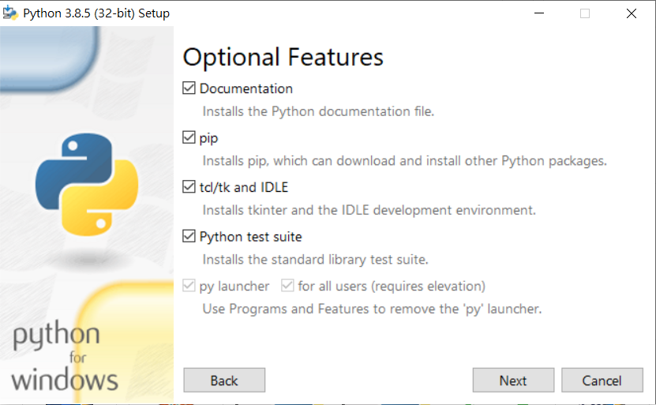

	2.5 進階功能頁面安裝的部份選擇預設,不需更改,但要選擇自訂的資料夾,以利未來的管理,點選「browse」按鈕,如圖2-5:
	

	2.6 請在c硬碟內,建立一個新的資料夾,命名為python385(任何名稱皆可以,以可以快速知道版本為最佳的命名方式),並點選c硬碟後,再點選python385的資料夾,讓資料夾的輸入欄內出現python385,這裏常出錯誤,請誤必小心.如圖2-6
	
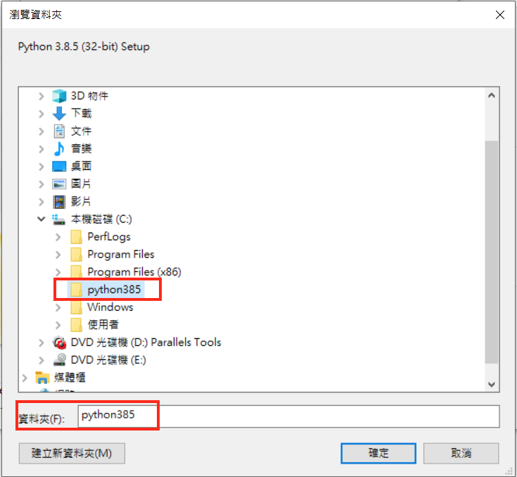
	
	2.7 安裝完成後,請按下「close」按鈕.如圖2-7
	
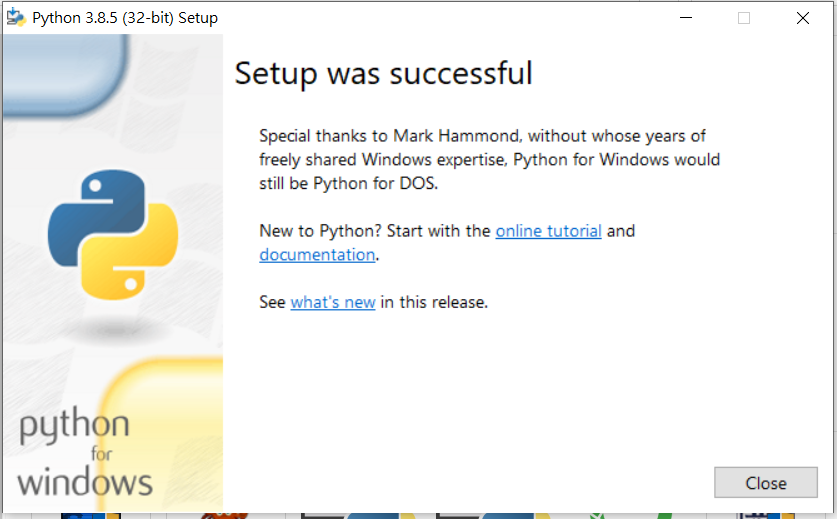

	2.8 在window的搜尋輸入python,選取python3.8應用程式,並以系統管理員身分執行.如圖2-8
	
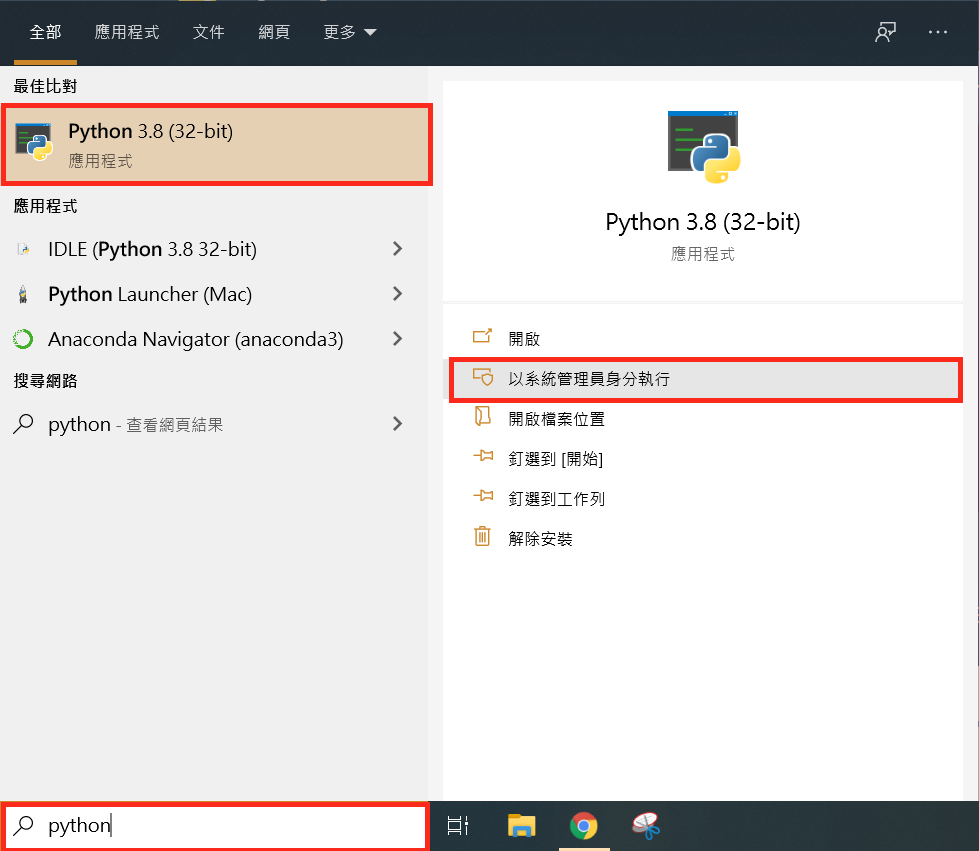

	2.9 在python3.8應用視窗內,輸入
	>>> print('Hello! python.')
	Hello! python.
	
	代表已經安裝成功。如圖2-9
	
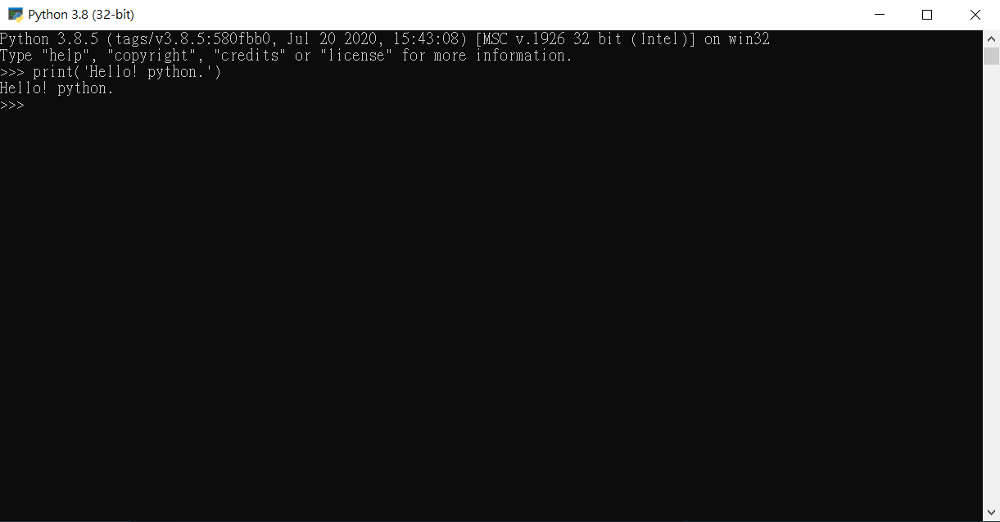

### 3.使用免費編輯器VS Code當作編輯器
	3.1 下載VS Code(https://code.visualstudio.com/).如圖3-1
	
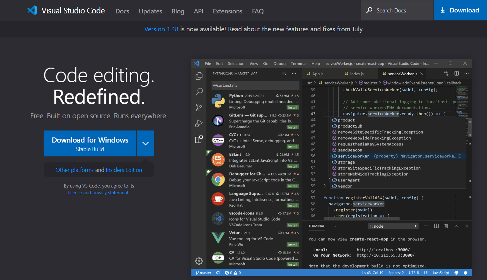

	3.2 執行VS Code安裝程式
	3.3 安裝過程皆使用預設設定，按下一步來完成完整安裝
	3.4 開始virtual studio code應用程式.如圖3-2
	
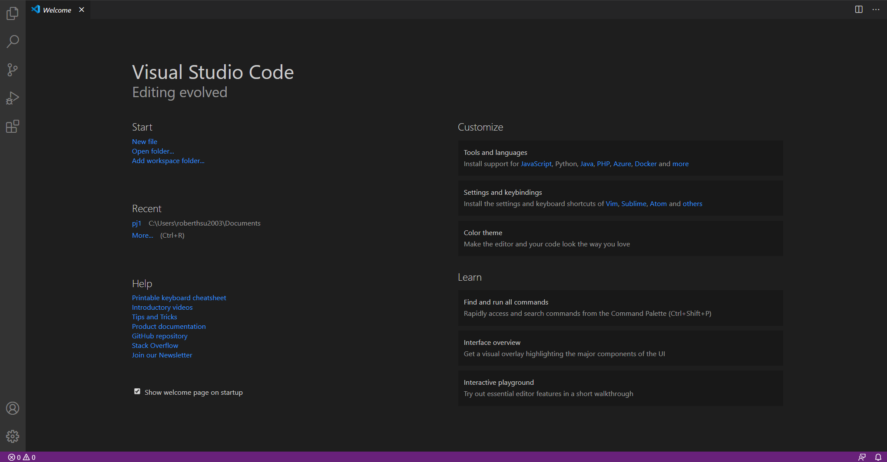

	3.5 安裝python extensions,點選extensions,搜尋python,並且安裝python extension.如圖3-3

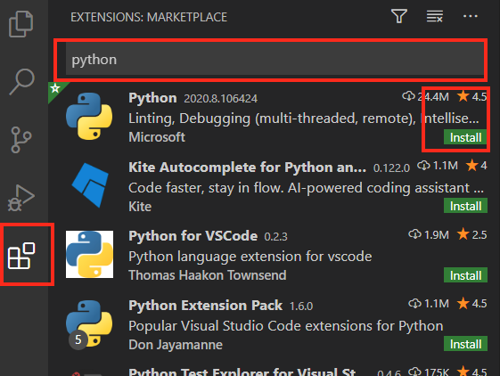

	3.6 安裝完extensions的畫面.如圖3-4.
	
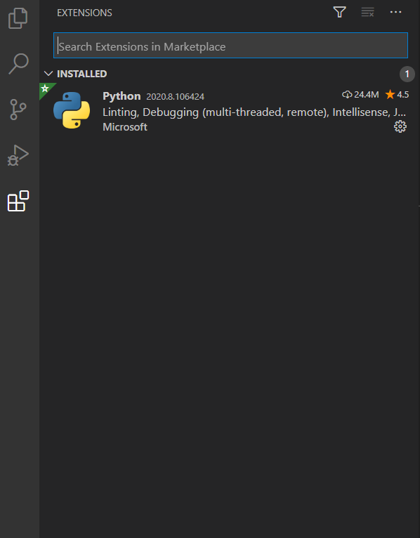
	
	3.7 從file->open Foler, 在文件目錄內,建立一個專案pythonProject 資料夾,並選擇該資料夾。如圖3-5.
	

	3.8 在pythonProject目錄內,建立sample1.py檔案, 並按下enter,過程中如果自動要安裝其它應用程式請按yes。如圖3-6

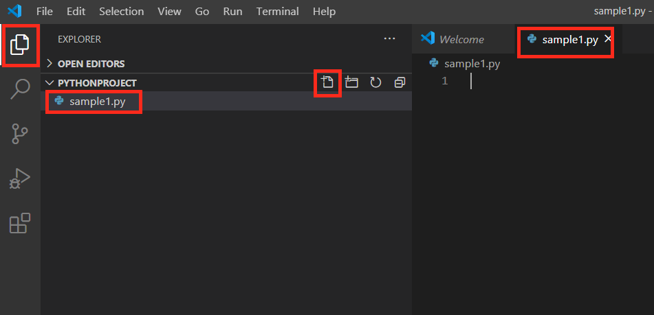

	3.9 請輸入print('Hello! python.'),並按下右上角的執行,下方TERMINAL出現Hello! python,代表安裝完成.如圖3-7
	
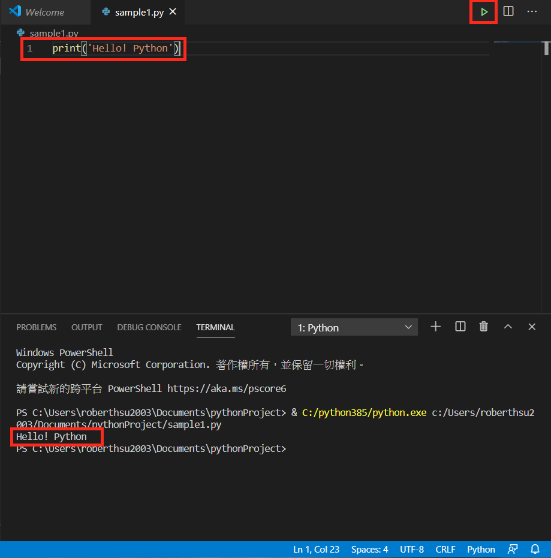

	3.10 請建立sample1.ipynb的jupyter notebook檔案,建立過程中如果右下角要求您安裝其它軟體,請按下「yes」.如圖3-8
	

	3.11 在儲存格內輸入print('Hello! python.'), 並按下右邊的執行按鈕,出現 Hello! python.,代表jupyter notebook也安裝成功,此時的功能將和雲端colab的畫面相似.如圖3-9
	

### 3個方法的任一方法,皆足以開始學習python.要有良好的編輯環境，請依序完成第2種方法,和第3種方法。

	

	
	
	

	
	

	

	
	

	
	
	